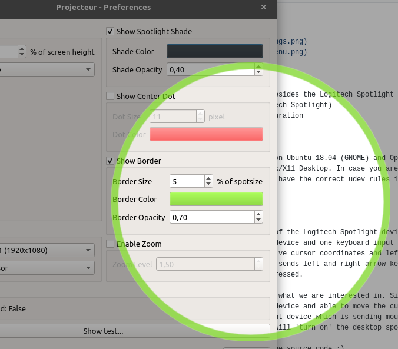

# Projecteur

develop: [](https://travis-ci.org/jahnf/Projecteur)
master: [](https://travis-ci.org/jahnf/Projecteur)

Linux/X11 application for the Logitech Spotlight device. \
See [Download](#download) section for binary packages.

Copyright 2018-2019 [Jahn Fuchs](mailto:projecteur@jahn.textmo.de)

## Motivation

I saw the Logitech Spotlight device in action at a conference and liked it
immediately. Unfortunately as in a lot of cases software is only provided for Windows
and Mac. The device itself works just fine on Linux, but the cool spot feature
is done by additional software.

So here it is: a Linux application for the Logitech Spotlight.

## Features

* Configurable desktop spotlight 
  * _shade color_, _opacity_, _cursor_, _border_, _center dot_ and different _shapes_.
  * Zoom (magnifier) functionality.
* Multiple screen support

### Screenshots

[](./doc/screenshot-settings.png)
[](./doc/screenshot-spot.png)
[](./doc/screenshot-traymenu.png)

### Planned features

* Possibly support other devices besides the Logitech Spotlight
* Vibration (Timer) Support (Logitech Spotlight)
* Support for device button configuration

## Supported Environments

The application was mostly tested on Ubuntu 18.04 (GNOME) and OpenSuse 15 (GNOME)
but should work on almost any Linux/X11 Desktop. In case you are building the
application youself, make sure you have the correct udev rules installed
(see Installation Pre-requisites).

## How it works

Basically the USB Dongle Receiver of the Logitech Spotlight device will end up
being detected as one mouse input device and one keyboard input device.
The mouse input device sends relative cursor coordinates and left button presses.
The keyboard device basically just sends left and right arrow key events when
forward or back on the device is pressed.

The detected mouse input device is what we are interested in. Since it's
already detected as a mouse input device and able to move the cursor, we will
simply detect if it is the Spotlight device which is sending mouse events.
If it is sending mouse events, we will 'turn on' the desktop spot.

For more details: Have a look at the source code ;)

## Download

The latest binary packages for some Linux distributions are available for downloaded on bintray. 
Currently binary packages for _Ubuntu_, _Debian_, _Fedora_, _OpenSuse_ and 
_Arch_ Linux are automatically built.

Latest develop:
[  ](https://bintray.com/jahnf/Projecteur/projecteur-develop/_latestVersion#files)

Latest release:
[  ](https://bintray.com/jahnf/Projecteur/projecteur-master/_latestVersion#files)

_**Only** for versions v0.6-alpha.30 and older_: 
Make sure to add the user running the application to the `spotlight-device` group
after package installation. This group is created during installation of the binary packages. \
When adding your user to a new group you will need to login and logout again
for the change to take full effect.

## Building

### Requirements

* C++11 compiler
* CMake 3.6 or later
* Qt 5.7 and later

### Build Example

Note: You can omit setting the `QTDIR` variable, CMake will then usually find
the Qt version that comes with the distribution's package management.

      > git clone https://github.com/jahnf/projecteur
      > cd projecteur
      > mkdir build && cd build
      > QTDIR=/opt/Qt/5.9.6/gcc_64 cmake ..
      > make

## Installation/Running

### Pre-requisites

#### When using pre-built binary packages

_**Only** for versions v0.6-alpha.30 and older_: 
Make sure to add the user running the application to the `spotlight-device` group
after package installation. This group is created during installation of the binary packages. \
When adding your user to a new group you will need to login and logout again
for the change to take full effect.

#### When building Projecteur yourself

The input devices detected from the Spotlight device must be readable to the
user running the application. To make this easier there is a udev rule template
file in this repository: `55-spotlight.rules.in`

* Copy that file to `/etc/udev/rules.d/55-spotlight.rules`
* Most recent systems (using systemd) will automatically pick up the rule.
  If not, run `sudo udevadm control --reload-rules` and `sudo udevadm trigger`
  to load the rules without a reboot.
* After that the two input devices from the Logitech USB Receiver in /dev/input
  should have the group you used, i.e. the group you configured in the rules file.
* When building against the Qt version that comes with your distribution's packages
  you might need to install some  additional QML module packages. For example this
  is the case for Ubuntu, where you need to install the packages
  `qml-module-qtgraphicaleffrects`, `qml-module-qtquick-window2` and `qml-modules-qtquick2`
  to satisfy the application's runtime dependencies.

### Application Menu

The application menu is accessable via the system tray icon. There you will find
the preferences and the menu entry to exit the application.

### Command Line Interface

Additional to the standard `--help` and `--version` options, there is an option to send
commands to a running instance of _Projecteur_.

```
Usage: projecteur [option]

<Options>
  -h, --help             Show command line usage.
  -v, --version          Print application version.
  -c COMMAND             Send command to a running instance.

<Commands>
  spot=[on|off]          Turn spotlight on/off.
  settings=[show|hide]   Show/hide preferences dialog.
  quit                   Quit the running instance.
```

### Troubleshooting

#### Missing System Tray

_Projecteur_ was developed and tested on GNOME and KDE Desktop environments, but should
work on most other desktop environments. If the system tray with the _Application Menu_
is not showing, commands can be send to the application to bring up the preferences
dialog, to test the spotlight or quit the application.
See [Command Line Interface](#command-line-interface).

On some distributions that have a GNOME Desktop by default there is no system tray
extensions installed (_Fedora_ for example). You can install the "TopIcons Plus" GNOME
extension to have a system tray that can show the Projecteur tray icon (and also from other
applications like Dropbox or Skype)

#### Wayland

While not developed with Wayland in mind, some users reported _Projecteur_ works with
Wayland. If you experience problems, you can try to set the `QT_QPA_PLATFORM` environment
variable to `wayland`:

```
user@ubuntu1904:~/Projecteur/build$ QT_QPA_PLATFORM=wayland ./projecteur
Using Wayland-EGL
```

#### Device shows as not connected

If the device shows as not connected, there are some things you can do:

* Make sure the device is detected by the Linux system: Run
  `cat /proc/bus/input/devices | grep -A 3 "Vendor=046d"` \
  This should show one or multiple spotlight devices (among other Logitech devices)
* Make sure the detected devices have the correct user/group asssigned. \
  Run `ls -al /dev/input/event* | grep spotlight`
  (or replace `spotlight` by a string that matches the group you put into the
   udev rule file in case you edited it yourself).
* Make sure you don't have conflicting udev rules installed, e.g. first you installed
  the udev rule yourself and later you used the automatically built Linux packages to
  install _Projecteur_.
