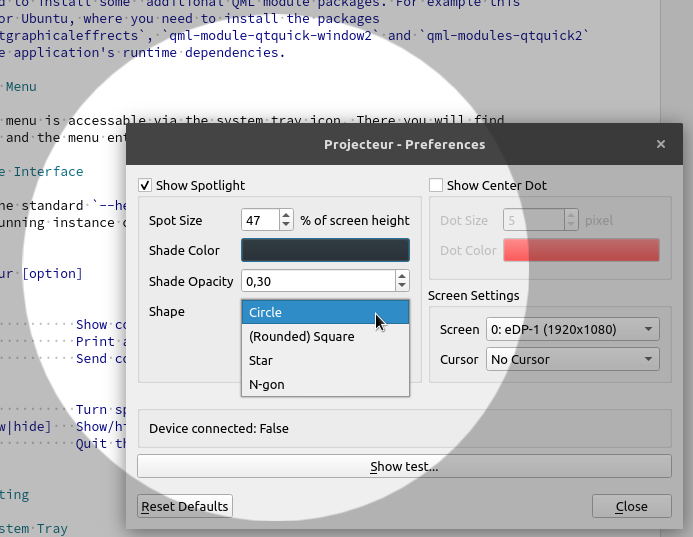
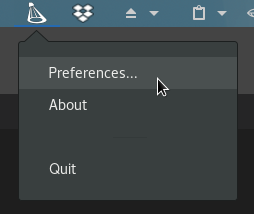

# Projecteur

develop: [](https://travis-ci.org/jahnf/Projecteur)
master: [](https://travis-ci.org/jahnf/Projecteur)

Linux/X11 application for the Logitech Spotlight device. \
See [Download](#download) section for binary packages.

Copyright 2018-2019 [Jahn Fuchs](mailto:github.jahnf@wolke7.net)

## Motivation

I saw the Logitech Spotlight device in action at a conference and liked it
immediately. Unfortunately as in a lot of cases software is only provided for Windows
and Mac. The device itself works just fine on Linux, but the cool spot feature
is done by additional software.

So here it is: a Linux application for the Logitech Spotlight.

## Features

* Configurable desktop spotlight. Configure color, opacity, cursor, center dot.
* Multiple screen support




## Supported Environments

The application was tested on Ubuntu 18.04 (GNOME) and OpenSuse 42.3 and 15 (GNOME)
but should work on almost any Linux/X11 Desktop. Make sure you have the correct
udev rules installed (see Installation Pre-requisites).

## How it works

Basically the USB Dongle Receiver of the Logitech Spotlight device will end up
being detected as one mouse input device and one keyboard input device.
The mouse input device sends relative cursor coordinates and left button presses.
The keyboard device basically just sends left and right arrow key events when
forward or back on the device is pressed.

The dectected mouse input device is what we are interested in. Since it's
already detected as a mouse input device and able to move the cursor, we will
simply detect if it is the Spotlight device which is sending mouse events.
If it is sending mouse events, we will 'turn on' the desktop spot.

For more details: Have a look at the source code ;)

## Download

The lastest automatically built binary packages for some Linux distributions can be downloaded from bintray:

[  ](https://bintray.com/jahnf/Projecteur/projecteur-develop/_latestVersion#files)

_Note_: Packaging is still new and in development. Some things might not work as 
expected. If so, please create an issue: https://github.com/jahnf/Projecteur/issues

## Building

### Requirements

* C++11 compiler
* CMake 3.6 or later
* Qt 5.6 and later

### Build Example

Note: You can ommit setting the `QTDIR` variable, CMake will then usually find the Qt version that comes with the distribution's packacke management.

      > git clone https://github.com/jahnf/projecteur
      > cd projecteur
      > mkdir build && cd build
      > QTDIR=/opt/Qt/5.9.6/gcc_64 cmake ..
      > make

## Installation/Running

### Pre-requisites

#### When using pre-built binary packages

Make sure the user running the application is in the `spotlight-device` group. \
This group is created during installation of the automatically built Linux binary 
packages from the travis-ci servers. 

_Note_: Packaging is still new and in development. Some things might not work as 
expected. If so, please create an issue: https://github.com/jahnf/Projecteur/issues

#### When building Projecteur yourself

The input devices detected from the Spotlight device must be readable to the
user running the application. To make this easier there is a udev rule template
file in this repository: `55-spotlight.rules.in`

* Copy that file to /etc/udev/rules.d/55-spotlight.rules and replace the
  '@DEVICE_USER_GROUP@' in the file with a group your user is a member in
* Run `sudo udevadm control --reload-rules` and `sudo udevadm trigger` to load
  the rules without a reboot.
* After that the two input devices from the Logitech USB Receiver in /dev/input
  should have the group you used, i.e. the group you configured in the rules file.
* When building against the Qt version that comes with your distribution's packages
  you might need to install some  additional QML module packages. For example this
  is the case for Ubuntu, where you need to install the packages
  `qml-module-qtgraphicaleffrects`, `qml-module-qtquick-window2` and `qml-modules-qtquick2`
  to satisfy the application's runtime dependencies.

### Application Menu

The application menu is accessable via the system tray icon. There you will find
the preferences and the menu entry to exit the application.

### Command Line Interface

Additional to the standard `--help` and `--version` options, there is an option to send
commands to a running instance of _Projecteur_.

```
Usage: projecteur [option]

<Options>
  -h, --help             Show command line usage.
  -v, --version          Print application version.
  -c COMMAND             Send command to a running instance.

<Commands>
  spot=[on|off]          Turn spotlight on/off.
  settings=[show|hide]   Show/hide preferences dialog.
  quit                   Quit the running instance.
```

### Troubleshooting

#### Missing System Tray

_Projecteur_ was developed and tested on GNOME and KDE Desktop environments, but should
work on most other desktop environments. If the system tray with the _Application Menu_
is not showing, commands can be send to the application to bring up the preferences
dialog, to test the spotlight or quit the application.
See [Command Line Interface](#command-line-interface).

#### Wayland

While not developed with Wayland in mind, some users reported _Projecteur_ works with
Wayland. If you experience problems, you can try to set the `QT_QPA_PLATFORM` environment
variable to `wayland`:

```
user@ubuntu1904:~/Projecteur/build$ QT_QPA_PLATFORM=wayland ./projecteur
Using Wayland-EGL
```
