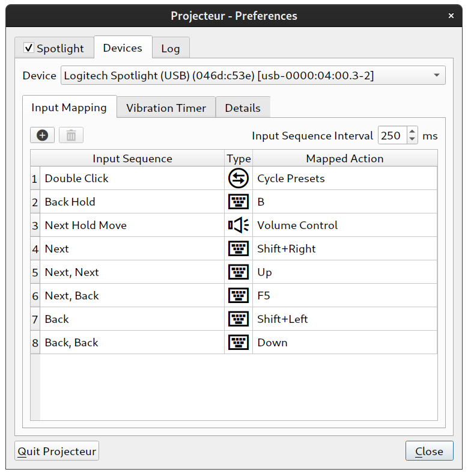

# Projecteur

develop: [  ](https://github.com/jahnf/Projecteur/actions?query=workflow%3Aci-build+branch%3Adevelop)
master: [  ](https://github.com/jahnf/Projecteur/actions?query=workflow%3Aci-build+branch%3Amaster)

Linux/X11 application for the Logitech Spotlight device (and similar devices). \
See **[Download](#download)** section for binary packages.

## Motivation

I saw the Logitech Spotlight device in action at a conference and liked it immediately.
Unfortunately as in a lot of cases, software is only provided for Windows and Mac.
The device itself works just fine on Linux, but the cool spotlight feature is
only available using additional software.

So here it is: a Linux application for the Logitech Spotlight.

## Table of Contents

  * [Motivation](#motivation)
  * [Features](#features)
  * [Supported Environments](#supported-environments)
  * [How it works](#how-it-works)
  * [Download](#download)
  * [Building](#building)
  * [Installation/Running](#installationrunning)
      * [Pre-requisites](#pre-requisites)
      * [Application Menu](#application-menu)
      * [Command Line Interface](#command-line-interface)
      * [Device Support](#device-support)
      * [Troubleshooting](#troubleshooting)
  * [License](#license)

## Features

* Configurable desktop spotlight
  * _shade color_, _opacity_, _cursor_, _border_, _center dot_ and different _shapes_.
  * Zoom (magnifier) functionality.
* Multiple screen support
* Support of devices besides the Logitech Spotlight (see [Device Support](#device-support))
* Button mapping:
  * Map any button on the device to (almost) any keyboard combination.
  * Switch between (cycle through) custom spotlight presets.

### Screenshots

[](./doc/screenshot-settings.png)
[](./doc/screenshot-spot.png)
[](./doc/screenshot-button-mapping.png)
[](./doc/screenshot-traymenu.png)

### Planned features

* Support for more customizable button mapping actions.
* Vibration (Timer) Support (Logitech Spotlight)

## Supported Environments

The application was mostly tested on Ubuntu 18.04 (GNOME) and OpenSuse 15 (GNOME)
but should work on almost any Linux/X11 Desktop. In case you are building the
application yourself, make sure you have the correct udev rules installed
(see [pre-requisites section](#pre-requisites)).

## How it works

With a connection via the USB Dongle Receiver or via Bluetooth, the Logitech Spotlight
device will be detected by Linux as a HID device with mouse and keyboard events.
As mouse events the device sends relative cursor movements and left button presses.
Acting as a keyboard, the device basically just sends left and right arrow key press
events when forward or back on the device is pressed.

The mouse move events of device is what we are mainly interested in. Since the device is
already detected as a mouse input device and able to move the cursor, we simply detect
if the Spotlight device is sending mouse move events. If it is sending mouse events,
we will 'turn on' the desktop spot (virtual laser).

For more details: Have a look at the source code ;)

### Button mapping

Button mapping works by **grabbing** all device events of connected
devices and forwarding them to a virtual _'uinput'_ device if not configured
differently by the button mapping configuration. If a mapped configuration for
a button exists, _Projecteur_ will inject the mapped keyboard events instead.
(You can still disable device grabbing with the `--disable-uinput` command
line option - button mapping will be disabled then.)

## Download

The latest binary packages for some Linux distributions are available for download on bintray.
Currently binary packages for _Ubuntu_, _Debian_, _Fedora_, _OpenSuse_, _CentOS_ and
_Arch_ Linux are automatically built.

* Latest develop:
[  ](https://bintray.com/jahnf/Projecteur/projecteur-develop/_latestVersion#files)

* Latest release:
[  ](https://bintray.com/jahnf/Projecteur/projecteur-master/_latestVersion#files)

See also the [list of Linux repositories](./doc/LinuxRepositories.md) where _Projecteur_
is available.

## Building

### Requirements

* C++14 compiler
* CMake 3.6 or later
* Qt 5.7 and later

### Build Example

```
    git clone https://github.com/jahnf/Projecteur
    cd Projecteur
    mkdir build && cd build
    cmake ..
    make
```

Building against other Qt versions, than the default one from your Linux distribution
can be done by setting the `QTDIR` variable during CMake configuration.

Example: `QTDIR=/opt/Qt/5.9.6/gcc_64 cmake ..`

## Installation/Running

### Pre-requisites

#### When building Projecteur yourself

The input devices detected from the Spotlight device must be readable to the
user running the application. To make this easier there is a udev rule template
file in this repository: `55-projecteur.rules.in`

* During the CMake run, the file `55-projecteur.rules` will be created from this template
  in your **build directory**. Copy that generated file to `/lib/udev/rules.d/55-projecteur.rules`
* Most recent systems (using systemd) will automatically pick up the rule.
  If not, run `sudo udevadm control --reload-rules` and `sudo udevadm trigger`
  to load the rules without a reboot.
* After that the input devices from the Logitech USB Receiver (but also the Bluetooth device)
  in /dev/input should be readable/writable by you.
  (See also about [device detection](#device-shows-as-not-connected))
* When building against the Qt version that comes with your distribution's packages
  you might need to install some  additional QML module packages. For example this
  is the case for Ubuntu, where you need to install the packages
  `qml-module-qtgraphicaleffects`, `qml-module-qtquick-window2`, `qml-modules-qtquick2` and
  `qtdeclarative5-dev` to satisfy the application's run time dependencies.

### Application Menu

The application menu is accessible via the system tray icon. There you will find
the preferences and the menu entry to exit the application. If the system tray icon is missing,
see the [Troubleshooting](#missing-system-tray) section.

### Command Line Interface

Additional to the standard `--help` and `--version` options, there is an option to send
commands to a running instance of _Projecteur_ and the ability to set properties.

```
Usage: projecteur [option]

<Options>
  -h, --help             Show command line usage.
  --help-all             Show complete command line usage with all properties.
  -v, --version          Print application version.
  -f, --fullversion      Print extended version info.
  --cfg FILE             Set custom config file.
  -d, --device-scan      Print device-scan results.
  -l, --log-level LEVEL  Set log level (dbg,inf,wrn,err), default is 'inf'.
  --show-dialog          Show preferences dialog on start.
  -m, --minimize-only    Only allow minimizing the preferences dialog.
  -D DEVICE              Additional accepted device; DEVICE=vendorId:productId
  -c COMMAND|PROPERTY    Send command/property to a running instance.

<Commands>
  spot=[on|off]          Turn spotlight on/off.
  settings=[show|hide]   Show/hide preferences dialog.
  quit                   Quit the running instance.
```

All the properties that can be set via the command line, are listed with the `--help-all` option.

### Device Support

Besides the _Logitech Spotlight_, the following devices are currently supported out of the box:

* AVATTO H100 / August WP200 _(0c45:8101)_
* August LP315 _(2312:863d)_
* AVATTO i10 Pro _(2571:4109)_

#### Compile Time

Besides the Logitech Spotlight, similar devices can be used and are supported.
Additional devices can be added to `devices.conf`. At CMake configuration time
the project will be configured to support these devices and also create entries
for them in the generated udev-rule file.

#### Runtime

_Projecteur_ will also accept devices as supported when added via the `-D`
command line option.

Example: `projecteur -D 04b3:310c`

This will enable devices within _Projecteur_ and the application will try to
connect to that device if it is detected. It is up to the user though to make
sure the device is accessible (via udev rules).

### Troubleshooting

#### Opaque Spotlight / No Transparency

To be able to show transparent windows a **compositing manager** is necessary. If there is no
compositing manager running you will see the spotlight overlay as an opaque window.

* On **KDE** it might be necessary to turn on Desktop effects to allow transparent windows.
* Depending on your Linux Desktop and configuration there might not be a compositing manager
  running by default. You can run `xcompmgr`, `compton` or others manually.
  * Examples: `xcompmgr -c -t-6 -l-6 -o.1` or `xcompmgr -c`

#### Missing System Tray

_Projecteur_ was developed and tested on GNOME and KDE Desktop environments, but should
work on most other desktop environments. If the system tray with the _Application Menu_
is not showing, commands can be send to the application to bring up the preferences
dialog, test the spotlight, quit the application or set spotlight properties.
See [Command Line Interface](#command-line-interface). There is also a command
line option (`-m`) to prevent the preferences dialog from hiding, allowing it
only to minimize - behaving more like a regular application window.

On some distributions that have a **GNOME Desktop** by default there is **no system tray extensions**
installed (_Fedora_ for example). You can install the
[KStatusNotifierItem/AppIndicator Support](https://extensions.gnome.org/extension/615/appindicator-support/)
or the [TopIcons Plus](https://extensions.gnome.org/extension/1031/topicons/)
GNOME extension to have a system tray that can show the _Projecteur_ tray icon
(and also from other applications like Dropbox or Skype).

#### Zoom is not updated while spotlight is shown

That is due to the fact how the zoom currently works. A screenshot is taken shortly before the
overlay window is shown, and then a magnified section is shown wherever the mouse/spotlight is.
If the zoom would be updated while the overlay window is shown, the overlay window it self would
show up in the magnified section. That is a general problem, that also other magnifier tools face,
although they can get around the problem by showing the magnified content rectangle always in the
same position on the screen.

#### Wayland

While not developed with Wayland in mind, users reported _Projecteur_ works with
Wayland. If you experience problems, you can try to set the `QT_QPA_PLATFORM` environment
variable to `wayland`, example:

```
user@ubuntu1904:~/Projecteur/build$ QT_QPA_PLATFORM=wayland ./projecteur
Using Wayland-EGL
```

#### Wayland Zoom

On Wayland the Zoom feature is currently only implemented on KDE and GNOME. This is done with
the help of their respective DBus interfaces for screen capturing. On other environments with
Wayland, the zoom feature is currently not supported.

#### Device shows as not connected

If the device shows as not connected, there are some things you can do:

* Check for devices with _Projecteur_'s command line option `-d` or `--device-scan` option.
  This will show you a list of all supported and detected devices and also if
  they are readable/writable. If a detected device is not readable/writable it is an indicator,
  that there is something wrong with the installed _udev_ rules.
* Manually on the shell: Check if the device is detected by the Linux system: Run
  `cat /proc/bus/input/devices | grep -A 5 "Vendor=046d"` \
  This should show one or multiple spotlight devices (among other Logitech devices)
  * Check you the corresponding `/dev/input/event??` device file is readable by you. \
    Example: `test -r /dev/input/event19 && echo "SUCCESS" || echo "NOT readable"`
* Make sure you don't have conflicting udev rules installed, e.g. first you installed
  the udev rule yourself and later you used the automatically built Linux packages to
  install _Projecteur_.

## License

Copyright 2018-2020 Jahn Fuchs

This project is distributed under the [MIT License](https://opensource.org/licenses/MIT),
see [LICENSE.md](./LICENSE.md) for more information.
